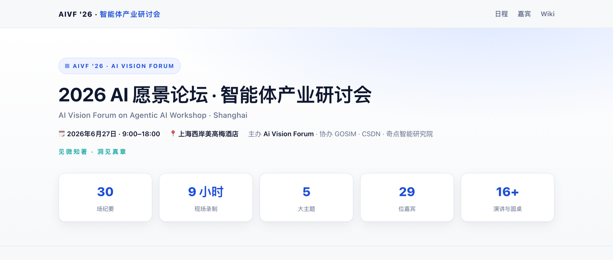
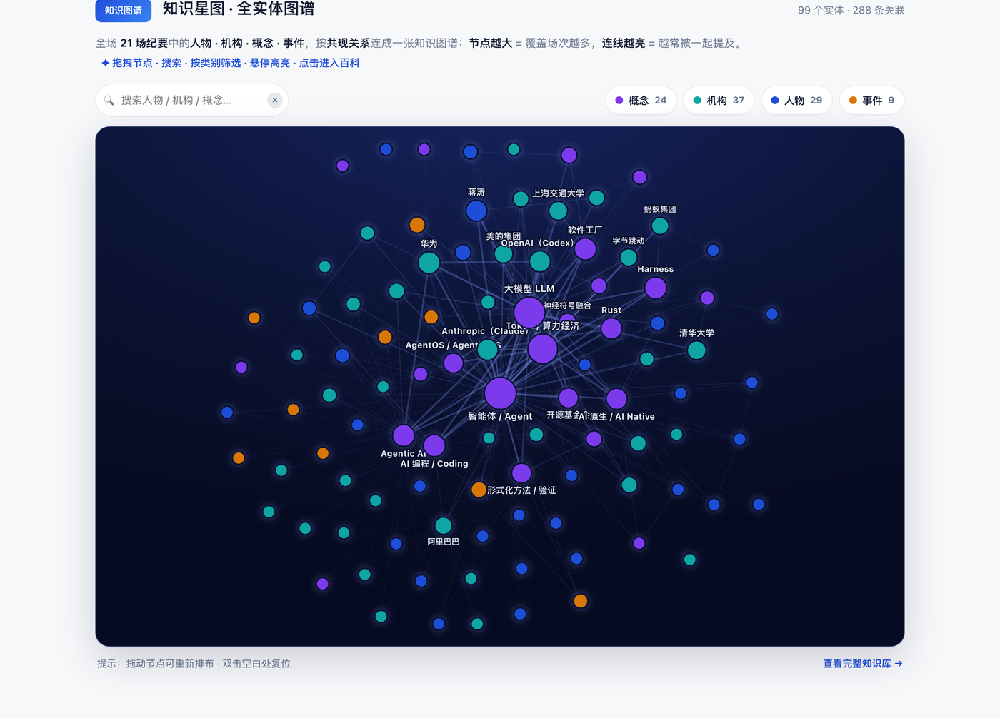
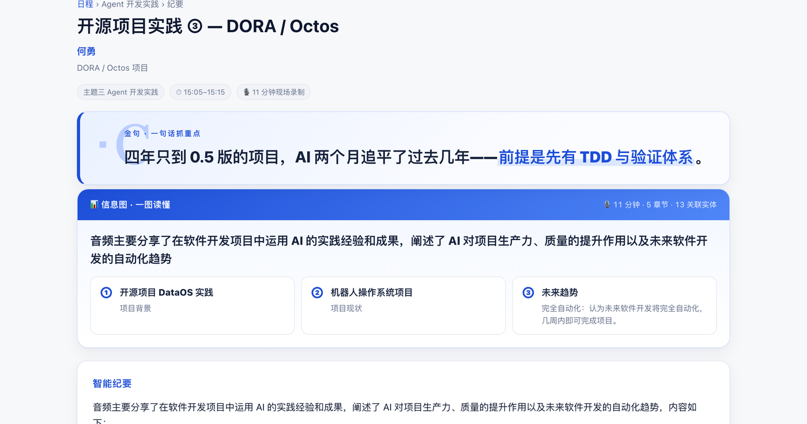
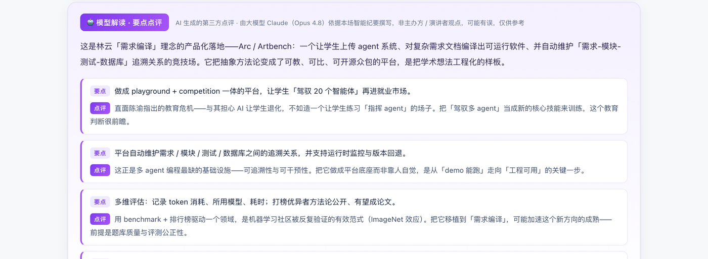

# 2026 AI 愿景论坛 · 智能体产业研讨会（上海站）

**AI Vision Forum on Agentic AI Workshop · Shanghai**
2026-06-27 · 上海西岸美高梅酒店 · 主办 Ai Vision Forum，协办 GOSIM · CSDN · 奇点智能研究院

&nbsp;

> 一个**非官方**的会议回顾站点：把这场闭门研讨会的 **30 场分享**，整理成可读、可查、可探索的**纪要、知识库与知识图谱**。纯静态 HTML / CSS / JS，无构建依赖、无第三方库。

---

## 📸 站点一览

### 🧠 知识星图 · 全实体图谱（首页）

99 个实体（**人物 / 机构 / 概念 / 事件**）、288 条共现关联连成的交互式知识图谱：节点越大 = 覆盖场次越多，连线越亮 = 越常被一起提及。支持 **搜索、按类别筛选、拖拽节点、悬停高亮、点击进入词条**。

### ✨ 金句 + 信息图（每个纪要页）

每页顶部放大的「**金句**」一句话抓重点，配「**信息图 · 一图读懂**」概览数据与要点。

### 🤖 模型解读 · 要点点评（每个纪要页）

由大模型对该场内容撰写的**第三方解读**与**逐要点标注**，帮你快速抓住看点与争议。

---

## 🗂 站点结构

| 路径 | 内容 |
| --- | --- |
| `index.html` | 首页：会议概览 + **知识星图** + 完整日程（5 大主题 / 22 环节）+ 嘉宾墙 |
| `talks/*.html` | 每场的智能纪要、章节速览、信息图、金句、模型解读、现场幻灯片、关联实体 |
| `speakers.html` | 嘉宾目录（29 位） |
| `wiki/` | **知识库**：公司·机构 / 人物 / 概念 / 事件·倡议，100+ 实体页，含频次与共现关系、实体↔分享双向互链 |
| `disclaimer.html` | 免责声明 |
| `slides/` | 现场幻灯片（131 张，**人脸已自动打码**） |

## 🚀 部署

仓库根目录即站点。Cloudflare Pages 连接本仓库即可（**构建命令留空，输出目录 `/`**），推送到 `main` 自动部署。

## ⚠️ 免责声明

本站为非官方会议回顾。站内的纪要、信息图、知识图谱，以及「模型解读 / 要点点评」，均由 AI（飞书妙记 + 大模型）从现场录音自动整理或生成，**可能存在偏差，仅供学习参考**；议程与嘉宾职务以官方会议日程为准，观点以演讲者原意为准。完整条款见 [免责声明](https://agentic-ai-shanghai-2026.pages.dev/disclaimer.html)。
